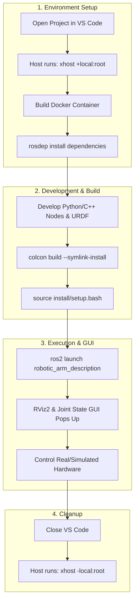
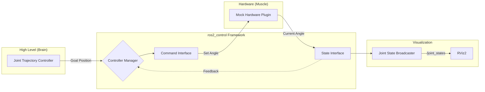
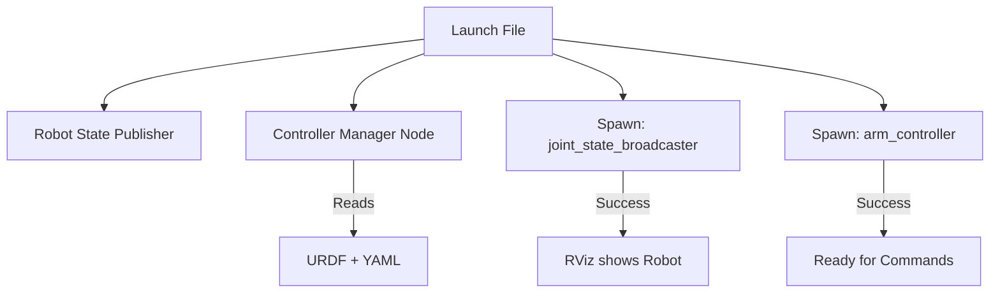

# ros2_robotic_arm
Use ros2 to control a robotic arm

It runs inside a Docker container so that the environment can be isolated.

## Tools
- Ubuntu 24.04
- ROS2 jazzy (docker images used)
- Docker 28.1.1

## Instalation
The only tool that has to be manually installed is Docker.

Install docker: https://docs.docker.com/desktop/setup/install/linux/ubuntu/

All the other dependencies are automatically installed

## VSCode
VSCode is prefered as it has some useful extensions for ROS and Docker:
https://code.visualstudio.com/docs/setup/linux

Make sure you install all recomended extensions

## Usage
Everything runs in a docker container (like a small virtual machine).
The official container osrf/ros:jazzy-desktop is used.
And the custom tools/packages are installed over it.

Steps:
1. build the container (official image + general dependencies)
2. run the container with gui support (so that application like rviz and rqt can start in GUI mode)
3. build robotic arm project packages

There are two ways to start:
- VSCode DevContainers: 
    - it will do automatically the steps 1 and 2 (build and run)
    - just click op "Reopen in Container button". It will appear when opening the folder in VSCode
- Manually open a terminal and run: 
    - ./build_and_run_container.sh

## Important
If the rviz or other GUI is not opening, when running from container,
execute on the host terminal
```bash
xhost +local:root
```
This command gives permission to the applications from the container to show the GUI (Graphical User Interface) on the host pc.


## Status
- Install everything from scripts (configuration as code)
- Run inside docker container
- Robot description

## Useful ROS2 commands
- ros2 node list
- ros2 topic echo /tf
- ros2 run tf2_tools view_frames
- rm -rf build/ install/ log/

## Workflow
<details>
<summary><b>Workflow Diagram</b></summary>


</details>


## ROS_CONTROL


### Launch sequence


