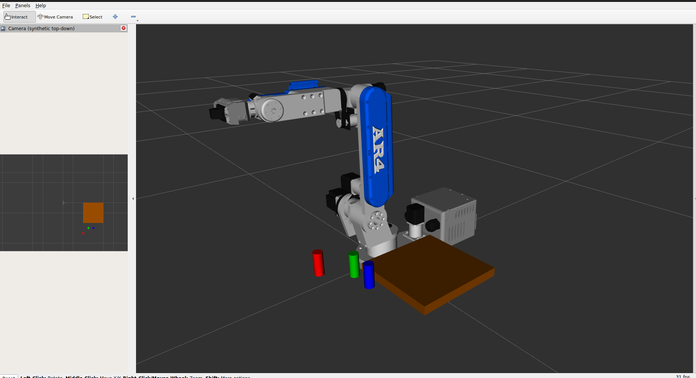

# ros2_robotic_arm
Use ROS2 to control a robotic arm inside a Docker container.

## Prerequisites

> **Native Linux is required.** Virtual machines and WSL are not supported —
> GUI forwarding (`xhost`) does not work reliably in those environments.
> Install Ubuntu 24.04 natively (bare-metal or dual boot).

| Requirement | To run | To develop |
|-------------|--------|------------|
| Native Linux (Ubuntu 24.04 recommended) | ✓ | ✓ |
| Docker | ✓ | ✓ |
| VSCode | — | ✓ |

ROS2 Jazzy and all other dependencies are installed automatically inside the Docker container.

## Installation

### Docker
Install Docker: https://docs.docker.com/engine/install/ubuntu/

### VSCode (required for development)
Install VSCode: https://code.visualstudio.com/docs/setup/linux

Open the project in VSCode and install all recommended extensions when prompted.

## Usage

Everything runs inside a Docker container. The official `osrf/ros:jazzy-desktop` image is used as the base, with project tools and packages installed on top.

**Step 0 — allow the container to open GUI windows (run once per host session):**
```bash
xhost +local:root
```

**Step 1 — start the container:**

- **VSCode DevContainers** (recommended): click "Reopen in Container" when opening the folder. This automatically builds and runs the container.
- **Terminal**: run `./build_and_run_container.sh`

**Step 2 — inside the container:**
```bash
./run.sh build          # build all ROS2 packages
./run.sh sim            # start RViz simulation
./run.sh tests          # run integration tests
```

## VSCode

VSCode is required for development. It provides DevContainers integration (automatic container build/run) and extensions for ROS2 and Docker.

Install VSCode: https://code.visualstudio.com/docs/setup/linux

Make sure you install all recommended extensions.

## Simulation



## Status
- Install everything from scripts (configuration as code)
- Run inside Docker container
- AR4 6-DOF robot description + gripper — URDF and MoveIt config from https://github.com/Annin-Robotics/ar4_ros_driver
- MoveIt2 config + KDL IK
- RViz visualization with colored collision objects
- Pick-and-place with planning scene updates
- Persistent motion server (7 actions + 2 services)
- Thin CLI client (`ros2 run robotic_arm_bringup arm <command>`)
- YAML-based object config
- Synthetic top-down camera + HSV vision pipeline
- Integration tests

## Useful ROS2 commands
```bash
ros2 node list
ros2 topic echo /tf
ros2 run tf2_tools view_frames
rm -rf build/ install/ log/
```

## Extra documentation
- [Development workflow](./doc/dev_workflow.md)
- [ROS Flowchart](./doc/ros_flowchart.md)
