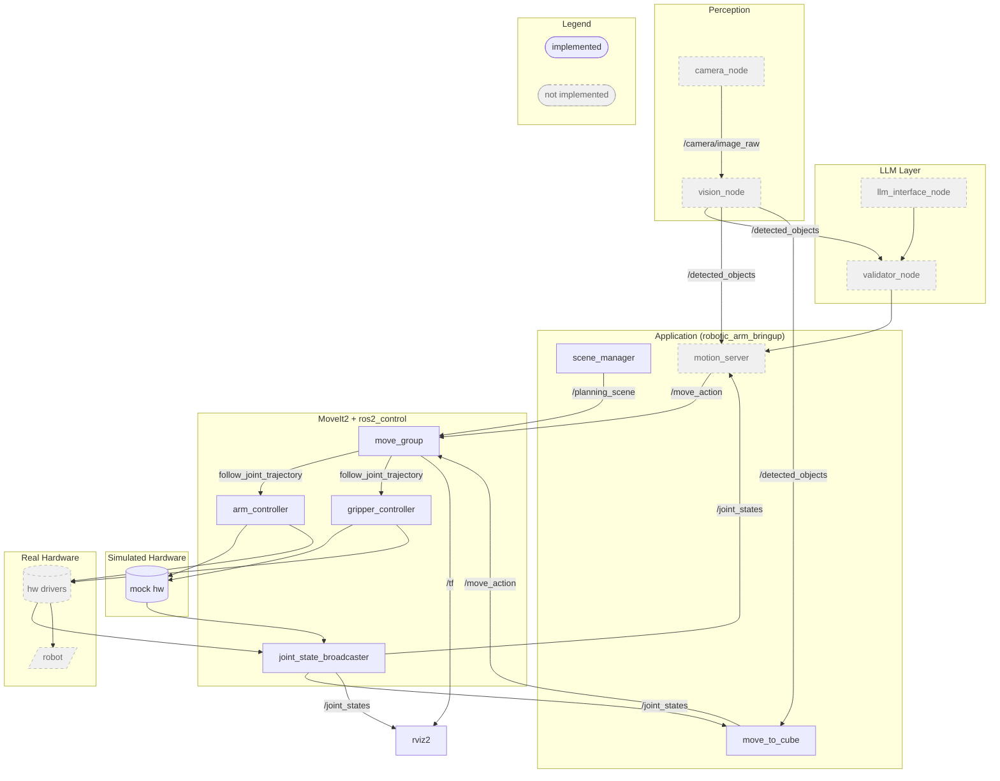

# ROS2 Robotic Arm — Architecture Reference

> **For Claude**: Keep this file up to date. Update it whenever you add/remove a node or topic, make an architectural decision, change the phase roadmap, or discover a new MoveIt/ROS2 constraint. This is the single source of truth for project structure — prefer updating this over scattering knowledge across session notes.

---

## Node Architecture

---

## Project Roadmap

- [x] **Phase 1** — CLI motion control (`move_to_cube`), scene manager, MoveIt2 integration, pick-and-place
- [ ] **Phase 2** — Refactor CLI into importable Python motion library (no new nodes)
- [ ] **Phase 3** — `motion_server` node: persistent ROS2 action server replacing one-shot CLI
- [ ] **Phase 4** — `camera_node`: camera sensor integration, publishes `/camera/image_raw`
- [ ] **Phase 5** — `vision_node`: object detection from camera, publishes `/detected_objects`; replaces hardcoded cube positions
- [ ] **Phase 6** — `llm_interface_node`: natural language → `validator_node` → motion server actions
- [ ] **Phase 6** — `validator_node`: validates LLM requests before execution (objects exist, positions reachable, etc.)

---

## Topics & Actions

| Name | Msg Type | Kind | Publisher | Subscriber / Client |
|------|----------|------|-----------|---------------------|
| `/planning_scene` | `moveit_msgs/PlanningScene` | topic | `scene_manager`, `move_to_cube` | `move_group` |
| `/joint_states` | `sensor_msgs/JointState` | topic | `joint_state_broadcaster` | `move_to_cube`, `robot_state_publisher` |
| `/tf` / `/tf_static` | `tf2_msgs/TFMessage` | topic | `robot_state_publisher` | `move_group`, RViz |
| `/display_planned_path` | `moveit_msgs/DisplayTrajectory` | topic | `move_group` | RViz |
| `/move_action` | `moveit_msgs/MoveGroup` | action | `move_group` (server) | `move_to_cube` (client) |
| `/arm_controller/follow_joint_trajectory` | `control_msgs/FollowJointTrajectory` | action | `arm_controller` (server) | `move_group` (client) |
| `/gripper_controller/follow_joint_trajectory` | `control_msgs/FollowJointTrajectory` | action | `gripper_controller` (server) | `move_group` (client) |

---

## Package Roles

| Package | Role | Key Files |
|---------|------|-----------|
| `robotic_arm_description` | Robot model: URDF/xacro, meshes, TF structure | `urdf/robotic_arm.urdf.xacro` |
| `robotic_arm_moveit_config` | MoveIt2 config: planning groups, IK, controllers, joint limits | `config/robotic_arm.srdf`, `config/kinematics.yaml`, `config/moveit_controllers.yaml` |
| `robotic_arm_bringup` | Application logic: scene setup, motion control, launch entry point | `robotic_arm_bringup/move_to_cube.py`, `robotic_arm_bringup/scene_manager.py`, `launch/arm_system.launch.py` |

---

## Architecture Decisions

### 1. MoveGroup action client (not MoveItPy)
- **What**: Motion goals sent via raw `MoveGroup` action to `/move_action`
- **Why**: MoveItPy requires complex config file setup; the action client works with minimal configuration and gives full control over goal construction
- **Rejected**: MoveItPy — additional YAML config layer, less transparent goal construction

### 2. PositionConstraint + JointConstraint with `position_only_ik: true`
- **What**: Goals specify a 1cm sphere `PositionConstraint` at the target XYZ, plus a `JointConstraint` on `joint_1` (±90° bias) to prevent 180° base flips. KDL solves IK internally.
- **Why**: Avoids implementing analytical IK; lets MoveIt handle redundancy resolution. The joint_1 bias keeps the arm facing the workspace front.
- **Rejected**: Analytical IK — caused CONTROL_FAILED errors and was brittle; full orientation constraint — 3-DOF arm can't achieve arbitrary orientations

### 3. AttachedCollisionObject for cube transport (cube stays visible)
- **What**: Before grasping, the cube collision object is attached to `grasp_link` via `AttachedCollisionObject`. It moves with the arm in RViz during transport. After placing, it is detached and re-added to the world scene at the new position.
- **Why**: Cube remains visible throughout the operation; more physically realistic than removing it
- **Rejected**: Removing cube from scene before grasp — cube disappears during operation, bad UX

### 4. Per-plan ACM via `planning_scene_diff` (arm path through cube)
- **What**: For arm motions that need to pass through the cube's collision zone (descent to grasp height), a `planning_scene_diff` with `AllowedCollisionMatrix` is passed per-plan so only that specific plan ignores the cube. The world scene is unaffected.
- **Why**: Arm would otherwise be blocked from descending into the cube's collision volume
- **Limitation**: Only works for path collision checking, NOT for start state collision checking. Also does not work for the gripper group — use `touch_links` instead for finger-cube collision

### 5. `touch_links` for gripper close (not ACM)
- **What**: The cube is attached to `grasp_link` BEFORE `close_gripper()` is called. `touch_links = ["left_finger", "right_finger", "grasp_link", "gripper_base"]` allows those links to contact the attached object, so MoveIt doesn't block the gripper close.
- **Why**: Per-plan ACM (`planning_scene_diff`) is not applied consistently to the gripper group — MoveIt still returns error 99999 for finger-cube collision if ACM is used
- **Rejected**: ACM for gripper — returns 99999 regardless

### 6. Lift arm before re-adding cube to world scene (step ordering)
- **What**: In `place_cube_at()`, the arm lifts away from the placed position BEFORE `update_cube_position()` re-adds the cube to the planning scene. Sequence: detach → open gripper → lift → re-add cube.
- **Why**: If the cube is re-added first, the arm's start state is inside the cube's collision geometry → MoveIt rejects the lift plan with `START_STATE_IN_COLLISION`. The ACM `planning_scene_diff` approach does NOT fix start state collision checks — they are evaluated separately from path collision.
- **Rejected**: Re-adding cube then lifting with allowed_object ACM — START_STATE_IN_COLLISION is checked before planning begins, not during path planning

### 7. Open-loop mock hardware
- **What**: `arm_controller` configured with `open_loop_control: true`; only `position` state interfaces (no velocity)
- **Why**: Mock hardware (no Gazebo) doesn't feed back real joint velocities. Without open-loop mode, the controller's state feedback checks fail and reject trajectories.
- **Note**: URDF's `<ros2_control>` section must export only `position` state interface — must match controller config exactly

---

## Known MoveIt / ROS2 Constraints

These constraints have caused bugs; remember them when making changes:

1. **Always set `start_state` on every MoveGroup plan** — when `is_diff = True` without explicit `start_state`, MoveIt assumes the robot is at home (0,0,0). Works for first move, breaks all subsequent moves. Fix: subscribe to `/joint_states` and pass current state via `_get_current_robot_state()`.

2. **`AttachedCollisionObject` persists across CLI invocations** — it lives in the MoveIt server process, not in Python memory. If any code path exits without calling `_detach_cube_from_gripper()`, the cube stays attached forever (until sim restart). Any later `--home` or other command will carry the cube along.

3. **Per-plan ACM (`planning_scene_diff`) does NOT fix start state collision** — start state collision is checked before planning begins as a separate step. The only fix is to ensure the arm is not inside a collision object at the start of a plan.

4. **Per-plan ACM does NOT work for gripper group** — returns 99999. Use `AttachedCollisionObject` with `touch_links` instead.

5. **Mimic joints cannot have command interfaces** — in `robotic_arm.ros2_control.xacro`, `right_finger_joint` must have only a state interface, no command interface. The URDF `<mimic>` tag is sufficient; adding a command interface causes a ros2_control crash.

6. **`colcon build` required (not `--symlink-install`) for non-Python files** — Python scripts with `--symlink-install` update without rebuild, but config files (YAML, URDF, SRDF) always need a full rebuild.

7. **KDL IK workspace**: 3-DOF arm cannot reach all XYZ positions. Minimum reachable Z depends on XY radius. At radius ~0.36m (e.g. 0.2, 0.3), minimum Z ≈ 0.4. At radius ~0.41m (e.g. 0.4, 0.1), Z = 0.3 is reachable. `place_cube_at()` auto-retries at Z+0.05 increments.
