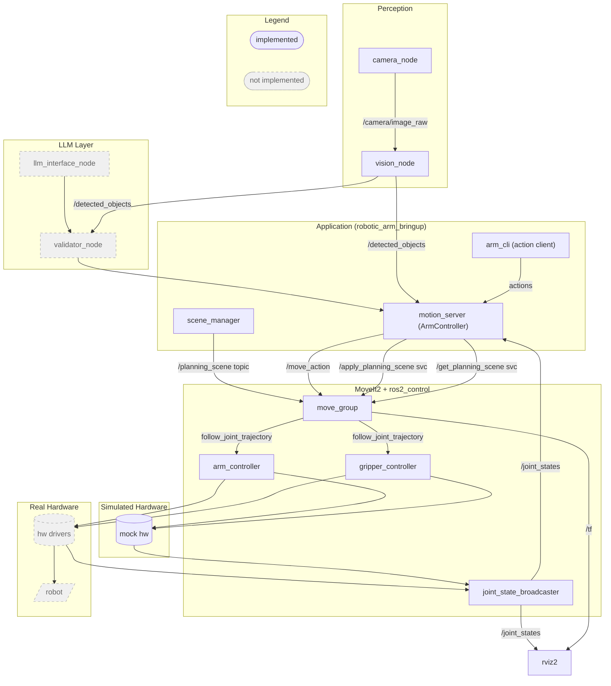
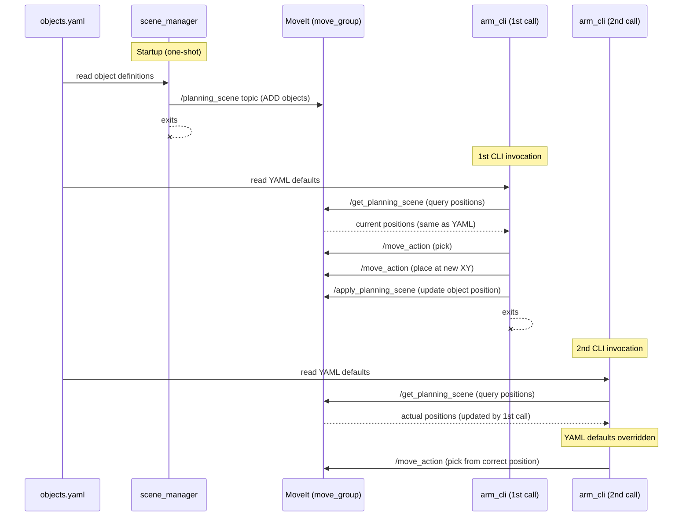

# ROS2 Robotic Arm — Architecture Reference

> **For Claude**: Keep this file up to date. Update it whenever you add/remove a node or topic, make an architectural decision, change the phase roadmap, or discover a new MoveIt/ROS2 constraint. This is the single source of truth for project structure — prefer updating this over scattering knowledge across session notes.

---

## Project Overview

1. **A robotic arm that lives inside a computer.** No physical robot exists yet — everything runs in simulation, visualized in a 3D viewer called RViz.

2. **The arm has a gripper** (like a hand) and can pick up objects, move them, and put them down somewhere else.

3. **There are currently three colored cylinders** (blue, red, green) and a basket in the scene. These are the objects the arm picks and places.

4. **You control the arm by typing commands**, e.g. "pick up the blue cube" or "place it at this position". There's no physical button or joystick.

5. **The arm figures out how to move by itself** — you give it a destination, it plans the path, avoids obstacles, and executes the motion. You don't program each joint angle manually.

6. **The project is being built in stages.** Right now it's at stage 2 of 6. The arm can already pick and place objects reliably.

7. **The next stages will add a camera** so the arm can see the scene, then computer vision to detect objects automatically rather than relying on hardcoded positions.

8. **The final goal is voice/text control** — you say "take the blue cube and put it in the basket" and the arm does it, driven by an AI language model.

9. **This is a learning project** for exploring ROS2 (the standard framework for programming robots), not a production system.

10. **Everything is software** — the robot, the physics, the sensors. Nothing is real yet. Real hardware is a future consideration.

---

## Node Architecture

```mermaid
flowchart TD
    classDef planned fill:#f0f0f0,stroke:#aaa,stroke-dasharray:5 5,color:#666

    subgraph llm["LLM Layer"]
        llm_interface_node
        validator_node
    end

    subgraph perception["Perception"]
        camera_node
        vision_node
    end

    subgraph app["Application (robotic_arm_bringup)"]
        scene_manager
        motion_server["motion_server (ArmController)"]
        arm_cli["arm_cli (action client)"]
    end

    subgraph infra["MoveIt2 + ros2_control"]
        move_group
        arm_controller
        gripper_controller
        joint_state_broadcaster
    end

    subgraph sim["Simulated Hardware"]
        mock_hw[(mock hw)]
    end

    subgraph hardware["Real Hardware"]
        hw_drivers[(hw drivers)]
        real_robot[/robot/]
    end

    rviz2

    subgraph legend["Legend"]
        impl([implemented])
        notimpl([not implemented]):::planned
    end

    class llm_interface_node,validator_node,hw_drivers,real_robot planned

    llm_interface_node --> validator_node
    validator_node --> motion_server
    camera_node -->|/camera/image_raw| vision_node
    vision_node -->|/detected_objects| validator_node
    vision_node -->|/detected_objects| motion_server

    scene_manager -->|/planning_scene topic| move_group
    arm_cli -->|actions| motion_server
    motion_server -->|/move_action| move_group
    motion_server -->|/apply_planning_scene svc| move_group
    motion_server -->|/get_planning_scene svc| move_group

    move_group -->|follow_joint_trajectory| arm_controller
    move_group -->|follow_joint_trajectory| gripper_controller
    arm_controller --> mock_hw
    gripper_controller --> mock_hw
    mock_hw --> joint_state_broadcaster

    arm_controller --> hw_drivers
    gripper_controller --> hw_drivers
    hw_drivers --> joint_state_broadcaster
    hw_drivers --> real_robot

    joint_state_broadcaster -->|/joint_states| motion_server
    joint_state_broadcaster -->|/joint_states| rviz2
    move_group -->|/tf| rviz2
```

---

## Object Position Data Flow

Shows how object positions flow through the system across CLI invocations.

```mermaid
sequenceDiagram
    participant YAML as objects.yaml
    participant SM as scene_manager
    participant MG as MoveIt (move_group)
    participant CLI1 as arm_cli (1st call)
    participant CLI2 as arm_cli (2nd call)

    Note over SM: Startup (one-shot)
    YAML->>SM: read object definitions
    SM->>MG: /planning_scene topic (ADD objects)
    SM--xSM: exits

    Note over CLI1: 1st CLI invocation
    YAML->>CLI1: read YAML defaults
    CLI1->>MG: /get_planning_scene (query positions)
    MG-->>CLI1: current positions (same as YAML)
    CLI1->>MG: /move_action (pick)
    CLI1->>MG: /move_action (place at new XY)
    CLI1->>MG: /apply_planning_scene (update object position)
    CLI1--xCLI1: exits

    Note over CLI2: 2nd CLI invocation
    YAML->>CLI2: read YAML defaults
    CLI2->>MG: /get_planning_scene (query positions)
    MG-->>CLI2: actual positions (updated by 1st call)
    Note over CLI2: YAML defaults overridden
    CLI2->>MG: /move_action (pick from correct position)
```

**Key insight**: MoveIt (`move_group`) is the persistent authority for object positions. Each CLI process is ephemeral — it reads YAML defaults, then queries MoveIt to override them with actual positions. After moving an object, it updates MoveIt directly via `/apply_planning_scene`. The next CLI invocation picks up those changes via `/get_planning_scene`.

---

## Project Roadmap

- [x] **Phase 1** — CLI motion control (`move_to_cube`), scene manager, MoveIt2 integration, pick-and-place
- [x] **Phase 2** — Importable motion library (`ArmController`) + YAML config + thin CLI (`arm`)
- [x] **Phase 3** — `motion_server` node: persistent ROS2 action server; CLI rewritten as action client
- [ ] **Phase 4** — Camera + vision: code written, **blocked by camera_node executor deadlock**. New `robotic_arm_perception` package. Design doc: [`doc/camera_vision.md`](camera_vision.md)
- [ ] **Phase 5** — LLM interface: `llm_interface_node` + `validator_node`; natural language → validated action goals → `motion_server`

---

## Topics & Actions

| Name | Msg Type | Kind | Publisher / Server | Subscriber / Client |
|------|----------|------|--------------------|---------------------|
| `/pick` | `robotic_arm_interfaces/Pick` | action | `motion_server` | `arm_cli`, any node |
| `/place` | `robotic_arm_interfaces/Place` | action | `motion_server` | `arm_cli`, any node |
| `/move_to` | `robotic_arm_interfaces/MoveTo` | action | `motion_server` | `arm_cli`, any node |
| `/home` | `robotic_arm_interfaces/Home` | action | `motion_server` | `arm_cli`, any node |
| `/reset` | `robotic_arm_interfaces/Reset` | action | `motion_server` | `arm_cli`, any node |
| `/open_gripper` | `robotic_arm_interfaces/OpenGripper` | action | `motion_server` | `arm_cli`, any node |
| `/close_gripper` | `robotic_arm_interfaces/CloseGripper` | action | `motion_server` | `arm_cli`, any node |
| `/list_objects` | `robotic_arm_interfaces/ListObjects` | service | `motion_server` | `arm_cli`, any node |
| `/planning_scene` | `moveit_msgs/PlanningScene` | topic | `scene_manager`, `motion_server` (fallback) | `move_group` |
| `/apply_planning_scene` | `moveit_msgs/ApplyPlanningScene` | service | `move_group` (server) | `motion_server` (client) |
| `/get_planning_scene` | `moveit_msgs/GetPlanningScene` | service | `move_group` (server) | `motion_server` (client) |
| `/camera/image_raw` | `sensor_msgs/Image` | topic | `camera_node` | `vision_node` |
| `/camera/camera_info` | `sensor_msgs/CameraInfo` | topic | `camera_node` | — |
| `/detected_objects` | `robotic_arm_interfaces/DetectedObjects` | topic | `vision_node` | `motion_server` |
| `/joint_states` | `sensor_msgs/JointState` | topic | `joint_state_broadcaster` | `motion_server`, `robot_state_publisher` |
| `/tf` / `/tf_static` | `tf2_msgs/TFMessage` | topic | `robot_state_publisher` | `move_group`, RViz |
| `/display_planned_path` | `moveit_msgs/DisplayTrajectory` | topic | `move_group` | RViz |
| `/move_action` | `moveit_msgs/MoveGroup` | action | `move_group` (server) | `motion_server` (client) |
| `/arm_controller/follow_joint_trajectory` | `control_msgs/FollowJointTrajectory` | action | `arm_controller` (server) | `move_group` (client) |
| `/gripper_controller/follow_joint_trajectory` | `control_msgs/FollowJointTrajectory` | action | `gripper_controller` (server) | `move_group` (client) |

---

## Package Roles

| Package | Role | Key Files |
|---------|------|-----------|
| `robotic_arm_description` | Robot model: URDF/xacro, meshes, TF structure | `urdf/robotic_arm.urdf.xacro` |
| `robotic_arm_moveit_config` | MoveIt2 config: planning groups, IK, controllers, joint limits | `config/robotic_arm.srdf`, `config/kinematics.yaml`, `config/moveit_controllers.yaml` |
| `robotic_arm_interfaces` | ROS2 action/service/message definitions for arm control | `action/*.action`, `srv/ListObjects.srv`, `msg/ObjectInfo.msg`, `msg/DetectedObject.msg`, `msg/DetectedObjects.msg` |
| `robotic_arm_bringup` | Application logic: action server, motion library, CLI client, scene setup | `motion_server.py`, `arm_controller.py`, `arm_cli.py`, `scene_manager.py`, `config/objects.yaml` |
| `robotic_arm_perception` | Camera + vision pipeline (Phase 4, implemented but camera_node has startup bug) | `camera_node.py`, `vision_node.py` — see [`doc/camera_vision.md`](camera_vision.md) |

---

## Architecture Decisions

### 1. MoveGroup action client (not MoveItPy)
- **What**: Motion goals sent via raw `MoveGroup` action to `/move_action`
- **Why**: MoveItPy requires complex config file setup; the action client works with minimal configuration and gives full control over goal construction
- **Rejected**: MoveItPy — additional YAML config layer, less transparent goal construction

### 2. PositionConstraint + JointConstraint with `position_only_ik: true`
- **What**: Goals specify a 1cm sphere `PositionConstraint` at the target XYZ, plus a `JointConstraint` on `joint_1` (±90° bias) to prevent 180° base flips. KDL solves IK internally.
- **Why**: Avoids implementing analytical IK; lets MoveIt handle redundancy resolution. The joint_1 bias keeps the arm facing the workspace front.
- **Rejected**: Analytical IK — caused CONTROL_FAILED errors and was brittle; full orientation constraint — 3-DOF arm can't achieve arbitrary orientations

### 3. AttachedCollisionObject for cube transport (cube stays visible)
- **What**: Before grasping, the cube collision object is attached to `grasp_link` via `AttachedCollisionObject`. It moves with the arm in RViz during transport. After placing, it is detached and re-added to the world scene at the new position.
- **Why**: Cube remains visible throughout the operation; more physically realistic than removing it
- **Rejected**: Removing cube from scene before grasp — cube disappears during operation, bad UX

### 4. Per-plan ACM via `planning_scene_diff` (arm path through cube)
- **What**: For arm motions that need to pass through the cube's collision zone (descent to grasp height), a `planning_scene_diff` with `AllowedCollisionMatrix` is passed per-plan so only that specific plan ignores the cube. The world scene is unaffected.
- **Why**: Arm would otherwise be blocked from descending into the cube's collision volume
- **Limitation**: Only works for path collision checking, NOT for start state collision checking. Also does not work for the gripper group — use `touch_links` instead for finger-cube collision

### 5. `touch_links` for gripper close (not ACM)
- **What**: The cube is attached to `grasp_link` BEFORE `close_gripper()` is called. `touch_links = ["left_finger", "right_finger", "grasp_link", "gripper_base"]` allows those links to contact the attached object, so MoveIt doesn't block the gripper close.
- **Why**: Per-plan ACM (`planning_scene_diff`) is not applied consistently to the gripper group — MoveIt still returns error 99999 for finger-cube collision if ACM is used
- **Rejected**: ACM for gripper — returns 99999 regardless

### 6. Lift arm before re-adding cube to world scene (step ordering)
- **What**: In `place()`, the arm lifts away from the placed position BEFORE `update_object_position()` re-adds the object to the planning scene. Sequence: detach → remove from scene → open gripper → lift → re-add object with color.
- **Why**: If the object is re-added first, the arm's start state is inside the object's collision geometry → MoveIt rejects the lift plan with `START_STATE_IN_COLLISION`. The ACM `planning_scene_diff` approach does NOT fix start state collision checks — they are evaluated separately from path collision.
- **Rejected**: Re-adding object then lifting with allowed_object ACM — START_STATE_IN_COLLISION is checked before planning begins, not during path planning

### 7. Open-loop mock hardware
- **What**: `arm_controller` configured with `open_loop_control: true`; only `position` state interfaces (no velocity)
- **Why**: Mock hardware (no Gazebo) doesn't feed back real joint velocities. Without open-loop mode, the controller's state feedback checks fail and reject trajectories.
- **Note**: URDF's `<ros2_control>` section must export only `position` state interface — must match controller config exactly

### 8. MoveIt as persistent position authority (not file/DB)
- **What**: Object positions persist across CLI invocations by querying MoveIt's `/get_planning_scene` service at startup. After moving an object, `ArmController` updates MoveIt via `/apply_planning_scene`. The next CLI invocation queries MoveIt to get the updated positions, overriding YAML defaults.
- **Why**: MoveIt already holds the authoritative planning scene. No need for a separate persistence layer (file, database, or persistent node). Simple and zero additional infrastructure.
- **Limitation**: If MoveIt restarts, positions reset to YAML defaults (scene_manager re-publishes from `objects.yaml`). Acceptable for Phase 2 — Phase 3's persistent action server will hold state in memory.
- **Rejected**: Persistent state file — adds complexity, risk of desync with MoveIt. Persistent ROS2 node — over-engineering for Phase 2.

---

## Known MoveIt / ROS2 Constraints

These constraints have caused bugs; remember them when making changes:

1. **Always set `start_state` on every MoveGroup plan** — when `is_diff = True` without explicit `start_state`, MoveIt assumes the robot is at home (0,0,0). Works for first move, breaks all subsequent moves. Fix: subscribe to `/joint_states` and pass current state via `_get_current_robot_state()`.

2. **`AttachedCollisionObject` persists across CLI invocations** — it lives in the MoveIt server process, not in Python memory. If any code path exits without calling `_detach_object()`, the object stays attached forever (until sim restart). Any later `home` or other command will carry the object along.

3. **Per-plan ACM (`planning_scene_diff`) does NOT fix start state collision** — start state collision is checked before planning begins as a separate step. The only fix is to ensure the arm is not inside a collision object at the start of a plan.

4. **Per-plan ACM does NOT work for gripper group** — returns 99999. Use `AttachedCollisionObject` with `touch_links` instead.

5. **Mimic joints cannot have command interfaces** — in `robotic_arm.ros2_control.xacro`, `right_finger_joint` must have only a state interface, no command interface. The URDF `<mimic>` tag is sufficient; adding a command interface causes a ros2_control crash.

6. **`colcon build` required (not `--symlink-install`) for non-Python files** — Python scripts with `--symlink-install` update without rebuild, but config files (YAML, URDF, SRDF) always need a full rebuild.

7. **KDL IK workspace**: 3-DOF arm cannot reach all XYZ positions. Minimum reachable Z depends on XY radius. At radius ~0.36m (e.g. 0.2, 0.3), minimum Z ≈ 0.4. At radius ~0.41m (e.g. 0.4, 0.1), Z = 0.3 is reachable. `place()` auto-retries at Z+0.05 increments.MEMORY.md

8. **Never call `rclpy.spin_once(self)` on a node spun by `rclpy.spin()`** — same executor deadlock as `spin_until_future_complete`. This bit `camera_node` in Phase 4.

9. **Never block inside a ROS2 callback with `time.sleep()` polling** — even with `MultiThreadedExecutor`, a blocked callback holds its thread. If all threads are blocked, service response callbacks can't fire → futures never complete. Use `future.add_done_callback()` for async service calls inside callbacks.

10. **MoveIt `CollisionObject.primitive_poses` are in object-local frame** — world position is in `co.pose.position`, not `co.primitive_poses[0].position`. Reading `primitive_poses` gives (0,0,0) for all normally-placed objects.

11. **`time.sleep()` does NOT spin the ROS2 executor** — topic publishes are queued but not delivered to MoveIt until the next `spin_once()` or `spin_until_future_complete()`. For planning scene updates that must be processed before the next motion, use the `/apply_planning_scene` service (synchronous), not the `/planning_scene` topic.
