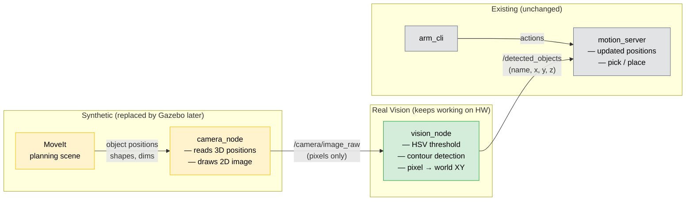
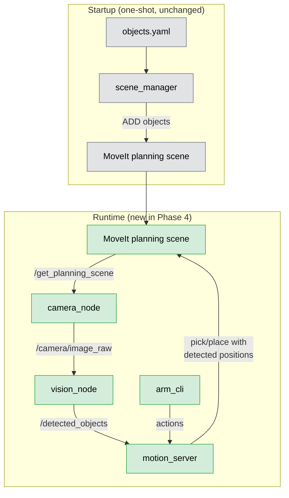

# Phase 4 — Camera + Vision Pipeline

> **Status**: 26/28 tests passing. Camera renders correctly. Two vision position tests failing — `motion_server` position updates from vision temporarily disabled. See CHANGELOG.md for bug history.

## Overview

Replace hardcoded object positions (`objects.yaml`) with a real vision pipeline that discovers positions from camera images. No Gazebo — uses a synthetic camera that renders the MoveIt scene. The detection algorithm is real and works from pixels only.

---

## Architecture — What's real vs synthetic

---

## The swap boundary — why this design works

The `/camera/image_raw` topic is the clean boundary. Everything to its right is real, permanent code — written once, works on synthetic images, Gazebo, and real hardware.

```mermaid
flowchart TD
    classDef swap fill:#fff3cd,stroke:#ffc107,color:#000
    classDef keep fill:#d4edda,stroke:#28a745,color:#000

    subgraph now["Phase 4 — Now"]
        A1["camera_node\nsynthetic renderer"]:::swap
        A1 -->|/camera/image_raw| B1
        B1["vision_node"]:::keep
        B1 -->|/detected_objects| C1["motion_server"]:::keep
    end

    subgraph later["Phase 4.5 — Gazebo"]
        A2["Gazebo camera\nreal rendered image"]:::swap
        A2 -->|/camera/image_raw| B2
        B2["vision_node\nSAME CODE"]:::keep
        B2 -->|/detected_objects| C2["motion_server\nSAME CODE"]:::keep
    end

    subgraph hw["Future — Real HW"]
        A3["USB camera\nreal sensor"]:::swap
        A3 -->|/camera/image_raw| B3
        B3["vision_node\nSAME CODE"]:::keep
        B3 -->|/detected_objects| C3["motion_server\nSAME CODE"]:::keep
    end
```

**Yellow** = swappable image source (changes per stage) | **Green** = real pipeline code (written once)

---

## Data flow

---

## How the synthetic camera works

`camera_node` renders a top-down orthographic image of the scene:

1. Queries MoveIt `/get_planning_scene` at ~10Hz for current object positions
2. Reads colors from `objects.yaml` (MoveIt doesn't reliably return colors)
3. Projects world XY → pixel UV: `u = cx + x * scale`, `v = cy - y * scale`
4. Draws colored shapes with OpenCV (circles for cylinders, rectangles for boxes)
5. Publishes `sensor_msgs/Image` on `/camera/image_raw`

## How the vision detection works

`vision_node` does real HSV color detection — it only sees pixels:

1. Subscribes to `/camera/image_raw`
2. Reads `objects.yaml` for color→name mapping and default Z height
3. For each object color: HSV threshold → binary mask → contours → centroid
4. Back-projects pixel centroid → world XY: `x = (u - cx) / scale`, `y = -(v - cy) / scale`
5. Z = fixed from `objects.yaml` (top-down camera can't see height)
6. Publishes `DetectedObjects` on `/detected_objects`

**Does NOT** query MoveIt, read planning scene, or access ground truth.

---

## Decisions

| Decision | Reasoning |
|----------|-----------|
| Synthetic camera (no Gazebo) | Fastest path to working pipeline. Gazebo swap is clean — only `camera_node` replaced |
| New `robotic_arm_perception` package | Clean separation. Entire package swappable for Gazebo |
| Color config from `objects.yaml` | Single source of truth — colors already defined there |
| Fixed Z from YAML | Top-down camera can't see height. All objects on same table surface |
| `motion_server` subscribes to detections | Minimal change — just a new subscriber + position update |

## Gazebo migration path (future)

Delete `camera_node.py`. Add Gazebo camera sensor to URDF + `ros_gz_bridge`. `vision_node`, messages, and `motion_server` subscriber stay identical.
