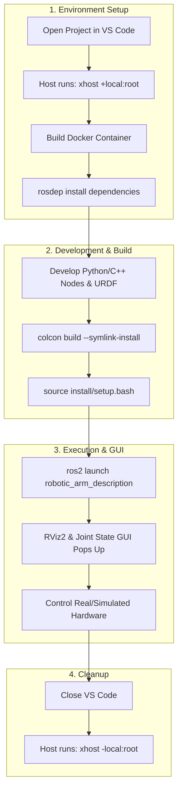

### Developement Workflow

```mermaid

graph TD
    subgraph "1. Environment Setup"
        A[Open Project in VS Code] --> B[Host runs: xhost +local:root]
        B --> C[Build Docker Container]
        C --> D[rosdep install dependencies]
    end

    subgraph "2. Development & Build"
        D --> E[Develop Python/C++ Nodes & URDF]
        E --> F[colcon build --symlink-install]
        F --> G[source install/setup.bash]
    end

    subgraph "3. Execution & GUI"
        G --> H[ros2 launch robotic_arm_description]
        H --> I[RViz2 & Joint State GUI Pops Up]
        I --> J[Control Real/Simulated Hardware]
    end

    subgraph "4. Cleanup"
        J --> K[Close VS Code]
        K --> L[Host runs: xhost -local:root]
    end
```
