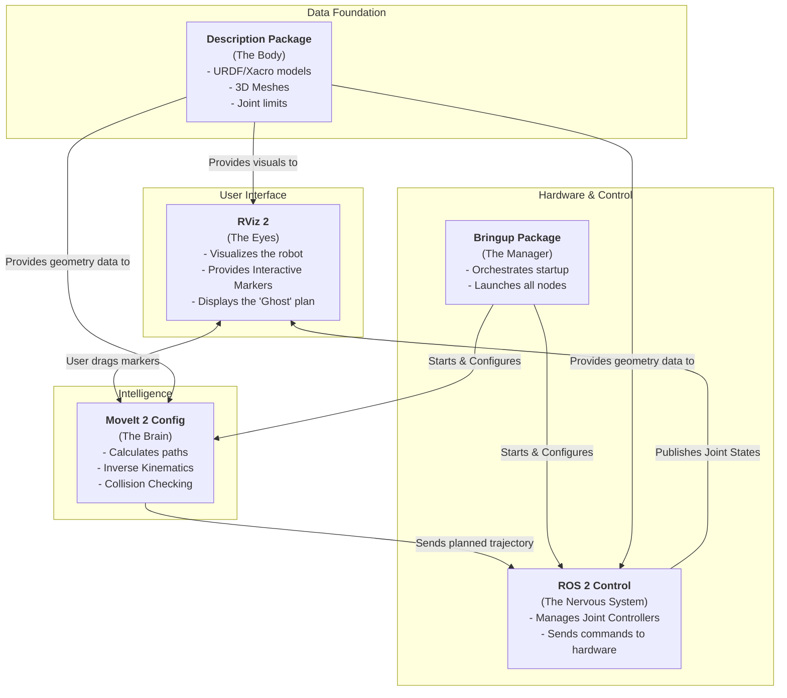

```mermaid
graph TD
    subgraph "User Interface"
        RViz["<b>RViz 2</b><br/>(The Eyes)<br/>- Visualizes the robot<br/>- Provides Interactive Markers<br/>- Displays the 'Ghost' plan"]
    end

    subgraph "Intelligence"
        MoveIt["<b>MoveIt 2 Config</b><br/>(The Brain)<br/>- Calculates paths<br/>- Inverse Kinematics<br/>- Collision Checking"]
    end

    subgraph "Hardware & Control"
        Bringup["<b>Bringup Package</b><br/>(The Manager)<br/>- Orchestrates startup<br/>- Launches all nodes"]
        ROSControl["<b>ROS 2 Control</b><br/>(The Nervous System)<br/>- Manages Joint Controllers<br/>- Sends commands to hardware"]
    end

    subgraph "Data Foundation"
        Description["<b>Description Package</b><br/>(The Body)<br/>- URDF/Xacro models<br/>- 3D Meshes<br/>- Joint limits"]
    end

    %% Interactions
    RViz <-->|User drags markers| MoveIt
    MoveIt -->|Sends planned trajectory| ROSControl
    ROSControl -->|Publishes Joint States| RViz
    Bringup -->|Starts & Configures| MoveIt
    Bringup -->|Starts & Configures| ROSControl
    Description -->|Provides geometry data to| MoveIt
    Description -->|Provides geometry data to| ROSControl
    Description -->|Provides visuals to| RViz
```